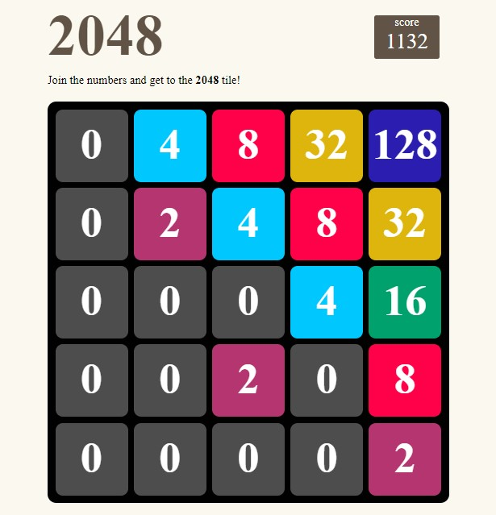

# 2048 Game

This repository contains the code for a 5x5 version of the popular game 2048. In this game, you combine numbers to create a tile with the number 2048. The game is played on a 5x5 grid, which makes it a bit more challenging than the original version.

## How to Play

Use your arrow keys to move the tiles. When two tiles with the same number touch, they merge into one! The game is won when a tile with a number 2048 is created. If the grid fills up and there's no room for a new tile, the game is over.

You can [play the game here](https://users.metropolia.fi/~annlinde/WebDevelopmentProjects/2048%20JS%20game/).

## Key JavaScript Concepts Practiced

In the process of coding this game, the following fundamental JavaScript concepts and methods have been practiced:

- DOM Manipulation: The game extensively uses DOM manipulation to dynamically update the game grid and score.

- Event Handling: Event listeners are used to respond to key presses, which drive the game's functionality.

- Array Methods: Various array methods like `filter()`, `concat()`, and `fill()` are used to manipulate the game grid.

- Control Flow: The game uses control flow statements like `if` and `for` loops to control game logic.

- Functions: Functions are used throughout the code to modularize the game logic and make the code more manageable and reusable.

- CSS Manipulation: The game uses JavaScript to dynamically update CSS styles, giving feedback to the player.

- Timer: The `setInterval()` method is used to periodically update the game grid's colours.

- Event Delegation: The game uses event delegation to handle key presses and control game flow.

## Future Development

Some ideas for future development include:

- Changing the game over condition so that the game ends when there are no more moves, not just when there's no space for new numbers.
- Restyling the "You Win" and "You Lose" messages for a more engaging user experience.

Contributions to the project are welcome!
